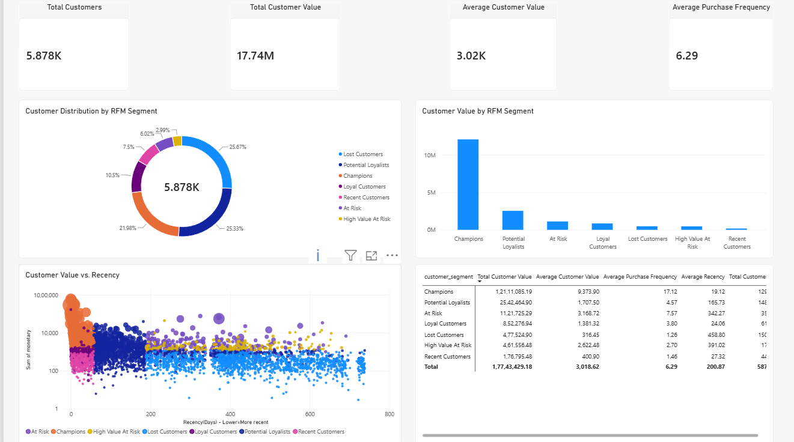
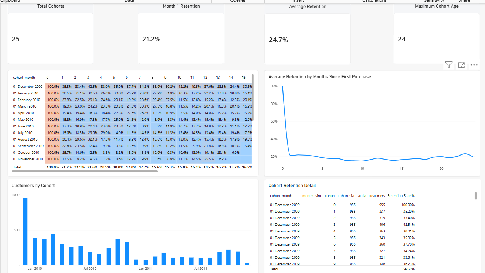
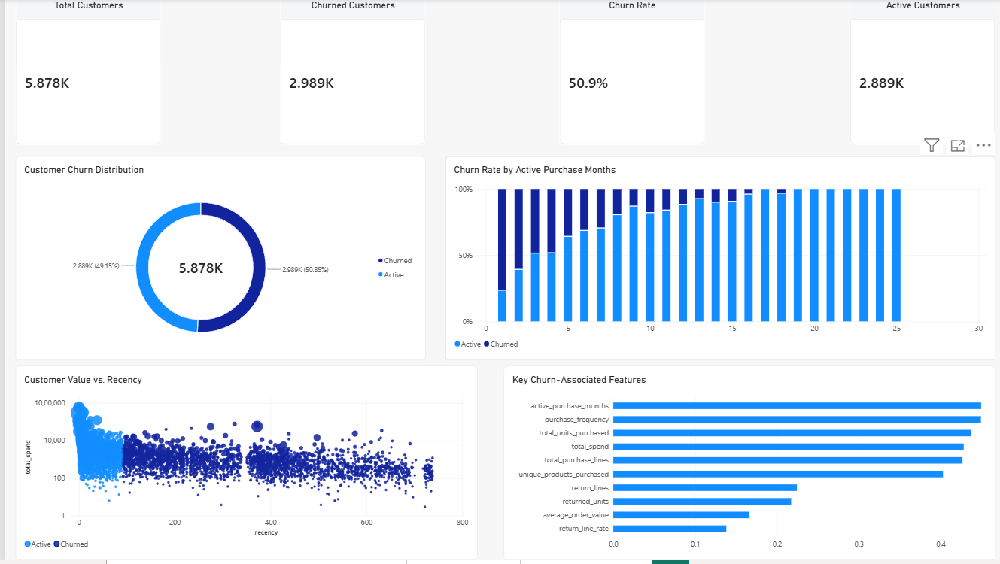
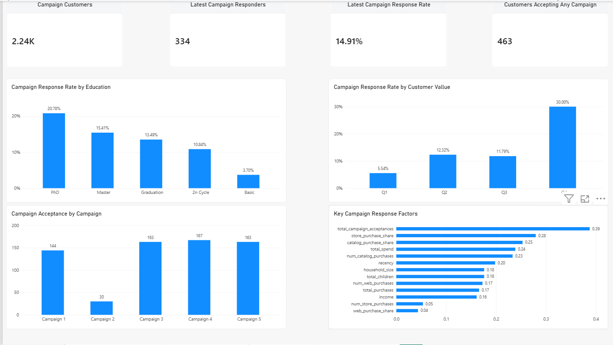

# Customer & Marketing Analytics

An end-to-end customer analytics project combining **PostgreSQL, SQL, Python, Pandas, statistical analysis, machine learning, and Power BI** to analyze customer value, retention, churn, and marketing campaign response.

The project uses two independent public datasets and treats them as separate analytical populations rather than joining them as if they belonged to the same company.

---

## Overview

This project demonstrates a complete analytics workflow:

**Raw Data → Data Validation → PostgreSQL → SQL Transformations → Customer Segmentation → Retention Analysis → Churn Analysis → Statistical Testing → Predictive Modeling → Campaign Analysis → Power BI → Business Insights**

### Business Questions

- Who are the highest-value customers?
- How can customers be segmented using RFM analysis?
- How does customer retention change across cohorts?
- Which behavioral characteristics are associated with churn?
- Can future churn be predicted using historical customer behavior?
- Which customers are more likely to respond to marketing campaigns?
- Which customer characteristics are associated with campaign response?
- Can machine learning help prioritize campaign outreach?

---

## Key Results

### Customer & Retention Analysis

- **5,878 customers** are available for the main Online Retail II customer-level analysis.
- RFM segmentation identifies **Champions, Loyal Customers, Recent Customers, At Risk, High Value At Risk, Lost Customers, and Potential Loyalists**.
- Cohort analysis contains **25 customer cohorts** with a maximum observable cohort age of **24 months**.
- Cohort retention declines as the time since first purchase increases.

### Churn Analysis

Because Online Retail II does not contain an explicit churn label, a reproducible **90-day inactivity rule** is used.

- Total customers: **5,878**
- Churned customers: **2,989**
- Active customers: **2,889**
- Churn rate: **~50.9%**

The strongest behavioral associations with churn include:

- Active purchase months
- Purchase frequency
- Total units purchased
- Total spend
- Total purchase lines
- Unique products purchased

### Churn Prediction

A chronological prediction experiment evaluates whether earlier customer behavior can predict churn at a later point in time.

| Model | ROC-AUC | PR-AUC | Precision | Recall | F1 |
|---|---:|---:|---:|---:|---:|
| Logistic Regression | 0.7595 | 0.7813 | 0.7218 | 0.7822 | 0.7508 |
| Random Forest | **0.8163** | **0.8231** | **0.7335** | **0.9086** | **0.8117** |

Random Forest provides the strongest overall performance.

Important predictive features include purchase volume, total spend, average order value, purchase frequency, active purchase months, and product breadth.

### Marketing Campaign Analysis

The Customer Personality Analysis dataset contains **2,240 customers**.

- Latest campaign responders: **334**
- Latest campaign response rate: **14.91%**
- Customers accepting at least one historical campaign: **463**

Campaign response varies substantially by customer value:

| Spend Quartile | Response Rate |
|---|---:|
| Q1 | 5.54% |
| Q2 | 12.30% |
| Q3 | 11.81% |
| Q4 | 30.00% |

Historical campaign engagement, customer spend, recency, income, and purchasing behavior are among the strongest signals associated with campaign response.

### Campaign Response Prediction

| Model | ROC-AUC | PR-AUC | Precision | Recall | F1 |
|---|---:|---:|---:|---:|---:|
| Logistic Regression | 0.8723 | 0.5898 | 0.3968 | **0.7463** | 0.5181 |
| Random Forest | **0.8841** | **0.6232** | **0.5556** | 0.5970 | **0.5755** |

Random Forest achieves the strongest overall performance.

Important predictive features include:

- Recency
- Previous campaign acceptances
- Total spend
- Store purchase share
- Income
- Catalog purchase share
- Web visits and purchasing behavior

---

## Datasets

This project uses two independent public datasets.

### 1. UCI Online Retail II

Transaction-level retail data used for:

- RFM analysis
- Customer segmentation
- Cohort retention
- Customer behavior analysis
- Inactivity-based churn definition
- Time-based churn prediction

The dataset contains transactions from a UK-based online retailer and spans 2009–2011.

The raw dataset is **not included in this repository**.

### 2. Customer Personality Analysis

Customer-level demographic, purchasing, channel, and campaign information used for:

- Customer profiling
- Campaign response analysis
- Statistical testing
- Campaign response prediction

The raw dataset is **not included in this repository**.

### Dataset Separation

The two datasets represent **separate analytical populations**.

They are intentionally **not joined using fabricated customer IDs or treated as data from one company**.

---

## Tech Stack

| Area | Technologies |
|---|---|
| Database | PostgreSQL |
| Querying | SQL |
| Data Processing | Python, Pandas, NumPy |
| Statistics | SciPy, Statsmodels |
| Machine Learning | Scikit-learn |
| Visualization | Matplotlib, Seaborn |
| BI / Dashboarding | Power BI |
| Testing | Pytest |
| Database Connectivity | SQLAlchemy, Psycopg2 |
| Environment | Python virtual environment |

---

## Analytical Workflow

### 1. Data Validation

The raw datasets are audited before loading into PostgreSQL.

Validation includes:

- Dataset dimensions
- Missing values
- Duplicate records
- Unique identifiers
- Date ranges
- Negative quantities
- Negative prices
- Zero-price transactions
- Cancellation invoices
- Campaign response distribution
- Income completeness

The raw retail data contains returns/cancellations and transactions without customer IDs. These are retained in the raw layer and handled explicitly during downstream analysis.

### 2. PostgreSQL Data Layer

The datasets are loaded into PostgreSQL using a structured database workflow.

The database contains:

- Raw transaction tables
- Raw customer/campaign tables
- Staging tables
- Analytical transformations
- Analytical views

Indexes are created on frequently queried fields such as customer ID, invoice, invoice date, product code, country, campaign response, and income.

### 3. Customer Segmentation — RFM

Customers are segmented using:

- **Recency** — how recently a customer purchased
- **Frequency** — number of distinct purchase invoices
- **Monetary** — total purchase value

RFM scores are generated using quintile-based scoring.

The resulting customer segments include:

- Champions
- Loyal Customers
- Recent Customers
- At Risk
- High Value At Risk
- Lost Customers
- Potential Loyalists

### 4. Cohort Retention

Customers are grouped into cohorts based on their first purchase month.

Retention is evaluated by:

- Cohort month
- Months since first purchase
- Cohort size
- Active customers
- Retention rate

The analysis produces retention curves, cohort heatmaps, cohort-size comparisons, and detailed cohort tables.

### 5. Churn Analysis

Because Online Retail II has no explicit churn label, churn is defined using a reproducible business rule:

> A customer is classified as churned when they have been inactive for at least 90 days relative to the observation end date.

Behavioral characteristics are compared between active and churned customers.

Statistical significance is evaluated using:

- Mann–Whitney U tests
- Effect sizes
- Benjamini–Hochberg FDR correction

The analysis focuses on associations rather than causal relationships.

### 6. Churn Prediction

A chronological modeling setup is used to reduce look-ahead bias.

Earlier customer snapshots are used for training and a later snapshot is used as the final test period.

Models evaluated:

- Logistic Regression
- Random Forest

Evaluation metrics:

- ROC-AUC
- PR-AUC
- Precision
- Recall
- F1-score

### 7. Marketing Campaign Analysis

The Customer Personality Analysis dataset is analyzed to understand the latest campaign response.

Analysis includes:

- Overall campaign response
- Response by education
- Response by customer spending quartile
- Historical campaign acceptance
- Customer purchasing behavior
- Channel behavior
- Statistical tests

Categorical variables are evaluated using chi-square tests.

Numeric variables are evaluated using Mann–Whitney U tests.

Multiple comparisons are controlled using Benjamini–Hochberg FDR correction.

### 8. Campaign Response Prediction

Two models are trained to predict response to the latest campaign:

- Logistic Regression
- Random Forest

The dataset is treated as cross-sectional, so a stratified 80/20 train-test split is used.

The models are evaluated using ROC-AUC, PR-AUC, precision, recall, and F1-score.

---

## Power BI Dashboard

The project contains a four-page Power BI dashboard.

### Page 1 — Customer Segmentation

Focuses on:

- RFM customer segments
- Customer value
- Recency
- Customer distribution



### Page 2 — Retention & Cohorts

Focuses on:

- Cohort retention
- Retention curves
- Cohort sizes
- Retention trends over time



### Page 3 — Churn Analysis

Focuses on:

- Churn rate
- Active vs churned customers
- Customer value vs recency
- Churn-associated behavioral features



### Page 4 — Campaign Analysis

Focuses on:

- Campaign response rate
- Response by education
- Response by customer spending quartile
- Historical campaign acceptance
- Campaign response factors



The Power BI `.pbix` file is kept locally and excluded from Git tracking because it is a binary file.

---

## Project Structure

```text
customer-marketing-analytics/
│
├── data/
│   ├── raw/
│   └── processed/
│
├── sql/
│   ├── schema/
│   ├── staging/
│   ├── transformations/
│   ├── analysis/
│   └── views/
│
├── src/
│   ├── data/
│   ├── analysis/
│   ├── statistics/
│   └── modeling/
│
├── notebooks/
│   └── customer_marketing_analysis.ipynb
│
├── powerbi/
│   ├── screenshots/
│   │   ├── 01_customer_segmentation.png
│   │   ├── 02_retention_cohorts.png
│   │   ├── 03_churn_analysis.png
│   │   └── 04_campaign_analysis.png
│   └── Customer_Marketing_Analytics.pbix
│
├── results/
├── scripts/
├── tests/
│
├── .gitignore
├── README.md
└── requirements.txt
```

Raw datasets, processed data, environment secrets, and the Power BI binary are excluded from version control.

---

## Reproducibility

### 1. Clone the repository

```bash
git clone https://github.com/Manas637/customer-marketing-analytics
cd customer-marketing-analytics
```

### 2. Create a virtual environment

Windows:

```bash
python -m venv .venv
.venv\Scripts\activate
```

Linux/macOS:

```bash
python3 -m venv .venv
source .venv/bin/activate
```

### 3. Install dependencies

```bash
pip install -r requirements.txt
```

### 4. Configure PostgreSQL

Create a PostgreSQL database named:

```text
customer_analytics
```

Create a local `.env` file:

```env
DB_HOST=localhost
DB_PORT=5432
DB_NAME=customer_analytics
DB_USER=postgres
DB_PASSWORD=your_password
```

Do not commit `.env` to Git.

### 5. Add the datasets

Place the raw datasets in:

```text
data/raw/
```

Expected files:

```text
data/raw/
├── online_retail_II.xlsx
└── marketing_campaign.csv
```

The marketing dataset is tab-separated and is loaded accordingly by the project loader.

### 6. Create database tables

Run the SQL files in the appropriate order, beginning with:

```text
sql/schema/
```

followed by:

```text
sql/staging/
sql/transformations/
sql/analysis/
sql/views/
```

### 7. Run validation

```bash
python -m src.data.validator
```

### 8. Run statistical analyses

```bash
python scripts/run_churn_statistics.py
python scripts/run_campaign_statistics.py
```

### 9. Run churn models

```bash
python scripts/run_churn_model.py
python scripts/run_churn_chronological.py
```

### 10. Run campaign response model

```bash
python scripts/run_campaign_model.py
```

### 11. Run the notebook

```bash
python -m jupyter notebook
```

Open:

```text
notebooks/customer_marketing_analysis.ipynb
```

The notebook provides the complete Python-based analytical walkthrough.

---

## Testing

The project includes automated tests using **pytest**.

Tests cover areas including:

- Raw data validation
- Data loading assumptions
- Staging transformations
- RFM calculations
- Cohort analysis
- Churn calculations
- Statistical analysis
- Campaign analysis
- Machine learning preprocessing
- Model outputs and metrics

Run the complete test suite with:

```bash
pytest
```

---

## Methodological Notes

### Churn Definition

Online Retail II does not contain a predefined churn label.

Therefore, churn is defined using a 90-day inactivity threshold. This is a business-rule-based analytical label rather than an original dataset field.

### Separate Datasets

The retail transaction dataset and Customer Personality Analysis dataset represent separate populations.

No fabricated relationship is created between their customer IDs.

### Statistical Interpretation

Statistical significance indicates evidence of association in the analyzed sample. It does not demonstrate causality.

### Machine Learning Interpretation

Feature importance indicates predictive relevance to the model. It does not mean that changing a feature will necessarily cause the predicted outcome to change.

### Campaign Modeling

The campaign dataset is cross-sectional, so a stratified train-test split is used rather than a temporal split.

### Churn Modeling

The churn prediction experiment uses chronological snapshots, with earlier snapshots used for training and a later snapshot used as the final test period.

---

## Limitations

- The Online Retail II dataset does not contain an explicit churn label.
- The 90-day inactivity threshold is an analytical business rule.
- The two datasets represent separate customer populations.
- Campaign analysis cannot establish causal effects.
- Campaign response modeling uses a cross-sectional split.
- Public datasets may not fully represent the behavior of a specific company's customers.
- Predictive model performance may change when applied to a different population or business environment.

---

## Skills Demonstrated

- SQL data modeling
- PostgreSQL
- Data cleaning and validation
- ETL/data loading
- Analytical SQL
- Window functions
- Customer segmentation
- RFM analysis
- Cohort analysis
- Retention analysis
- Churn analysis
- Statistical hypothesis testing
- Multiple-testing correction
- Feature engineering
- Logistic Regression
- Random Forest
- Model evaluation
- Pandas
- Data visualization
- Power BI dashboard development
- Automated testing
- Reproducible analytics workflows

---

## Final Takeaway

Customer analytics is most useful when descriptive analysis, statistical evidence, predictive modeling, and business visualization are connected into one workflow.

This project demonstrates that workflow from raw transaction and customer data through:

**SQL → Customer Analytics → Statistics → Machine Learning → Power BI → Business Recommendations**

The resulting analysis provides a foundation for customer segmentation, retention monitoring, churn prioritization, and marketing campaign targeting.
